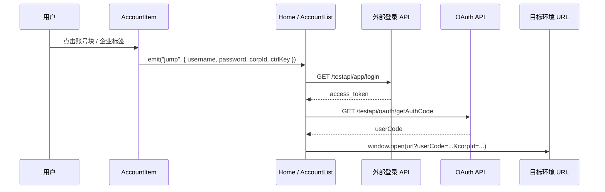
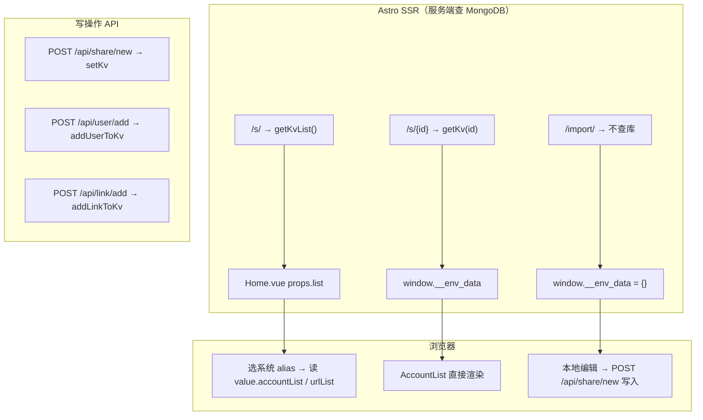

# 登录与跳转流程说明

本文档整理 env-share 项目中**数据如何查询与存储**、**后端接口**、**前端点击登录并跳转**的完整逻辑，并在 [第 8 章](#8-附录源码实现) 附上相关文件的**完整源码**。

---

## 1. 整体流程概览

用户点击账号或企业标签后，前端不会直接打开目标 URL，而是先调用外部登录服务换取 token 和 auth code，再拼接到目标环境 URL 上打开新窗口。



---

## 2. 外部登录 API（第三方服务）

基础地址：`https://env.lif3ng.cn:3443`

所有请求均需携带请求头：

| Header       | 值    |
| ------------ | ----- |
| `clientType` | `app` |

### 2.1 账号登录 — 获取 access_token

```
GET /testapi/app/login?username={手机号}&password={密码}
```

**响应结构（前端使用）：**

```json
{
  "data": {
    "access_token": "...",
    "name": "用户姓名"
  }
}
```

**使用场景：**

| 场景               | 调用位置                       | 用途                        |
| ------------------ | ------------------------------ | --------------------------- |
| 挂载时拉取企业列表 | `AccountItem.vue` onMounted    | 登录后查组织，展示可选企业  |
| 点击跳转           | `Home.vue` / `AccountList.vue` | 换取 token 后再取 auth code |

### 2.2 获取用户组织列表

```
GET /testapi/contact/v1/orInv/contactV2/get_my_info_organization
```

**请求头：**

| Header          | 值                      |
| --------------- | ----------------------- |
| `clientType`    | `app`                   |
| `Authorization` | `Bearer {access_token}` |

**响应结构（前端使用）：**

```json
{
  "data": {
    "corpUsers": [
      {
        "corpId": "6",
        "getCorpName": "天津美腾科技有限公司"
      }
    ]
  }
}
```

前端映射为 `{ corpId, name }` 供 UI 展示与跳转时使用。

### 2.3 获取 OAuth 授权码

```
GET /testapi/oauth/getAuthCode
```

**请求头：**

| Header          | 值                      |
| --------------- | ----------------------- |
| `clientType`    | `app`                   |
| `authorization` | `Bearer {access_token}` |

**响应结构（前端使用）：**

```json
{
  "data": "auth_code_string"
}
```

该 code 作为 query 参数 `userCode` 拼入目标环境 URL。

---

## 3. 项目自有后端 API（Astro Server Routes）

路由文件位于 `src/pages/api/`，数据持久化通过 `src/mongo.js` 连接 MongoDB（`mongodb://192.168.5.46:27017/env`）。

### 3.1 创建分享 — `POST /api/share/new`

**文件：** `src/pages/api/share/new.js`

**请求体：**

```json
{
  "key": "可选别名",
  "urlList": [{ "url": "...", "note": "..." }],
  "accountList": [
    {
      "username": "13800138000",
      "password": "xxx",
      "name": "张三",
      "corpList": [{ "corpId": "6", "name": "天津美腾科技有限公司" }]
    }
  ]
}
```

**响应：**

```json
{ "slug": "文档_id_或_alias" }
```

**调用方：** `AccountList.vue` 的 `save()`，成功后复制 `{origin}/s/{slug}` 到剪贴板。

---

### 3.2 添加用户 — `POST /api/user/add`

**文件：** `src/pages/api/user/add.js`

**请求体：**

```json
{
  "kvId": "KV 文档 ID 或 alias",
  "username": "13800138000",
  "name": "张三",
  "password": "zx111222",
  "corpList": [{ "corpId": "6", "name": "天津美腾科技有限公司" }]
}
```

**成功响应（201）：**

```json
{
  "success": true,
  "message": "User added to accountList successfully",
  "data": {
    "kvId": "...",
    "alias": "...",
    "accountListCount": 1
  }
}
```

**错误码：**

| HTTP | 说明                     |
| ---- | ------------------------ |
| 400  | 缺少必填字段             |
| 404  | KV 文档不存在            |
| 409  | 同环境下 username 已存在 |
| 500  | 服务器错误               |

**调用方：** `Home.vue` 的 `submitAddUser()`。

---

### 3.3 添加链接 — `POST /api/link/add`

**文件：** `src/pages/api/link/add.js`

**请求体：**

```json
{
  "kvId": "KV 文档 ID 或 alias",
  "url": "https://example.com/login",
  "note": "测试环境"
}
```

**成功响应（201）：**

```json
{
  "success": true,
  "message": "Link added to urlList successfully",
  "data": {
    "kvId": "...",
    "alias": "...",
    "urlListCount": 1
  }
}
```

**调用方：** `Home.vue` 的 `submitAddLink()`。

---

### 3.4 环境推荐 — `GET /api/recommend/{env}`

**文件：** `src/pages/api/recommend/[env].js`

**路径参数：** `env` 可为 `test` | `dev` | `prod`

代理请求 `http://192.168.5.46:3000/api/recommend?env={env}`，并为每个 URL 附加 `/build_version` 版本信息。

---

### 3.5 登录代理 — `src/pages/api/login.js`

当前文件为空，未实现任何逻辑。

---

## 4. 数据存储与查询

本项目**没有独立的 KV 读取 HTTP API**（如 `GET /api/kv/:id`）。账号、URL 等数据全部存在 MongoDB，由 Astro 页面在 **SSR 阶段**直接查库，或通过 **POST 写接口**增改。

### 4.1 MongoDB 连接

**文件：** `src/mongo.js`

```
mongodb://192.168.5.46:27017/env
```

**集合：** `kvs`（Mongoose model 名 `KV`）

**文档 Schema：**

```js
{
  alias: String,   // 系统别名，如 "测试"、"生产"
  value: Object,   // 实际业务数据，见 4.2
}
```

Mongoose 还会自动生成 `_id`（ObjectId），分享链接的 slug 可以是 `_id` 或 `alias`。

---

### 4.2 `value` 字段结构

每个 KV 文档的 `value` 是一个 JSON 对象，核心字段如下：

```json
{
  "urlList": [
    {
      "url": "https://example.com/sso/login?redirect=...",
      "note": "测试环境",
      "features": "noopener,noreferrer"
    }
  ],
  "accountList": [
    {
      "username": "13800138000",
      "password": "zx111222",
      "name": "张三",
      "corpList": [{ "corpId": "6", "name": "天津美腾科技有限公司" }]
    }
  ]
}
```

| 字段                     | 说明                                                           |
| ------------------------ | -------------------------------------------------------------- |
| `urlList[].url`          | 目标环境登录页地址，跳转时在此 URL 上追加 `userCode`、`corpId` |
| `urlList[].note`         | 环境显示名称，主页左侧「环境列表」用此字段匹配选中项           |
| `urlList[].features`     | 可选，`window.open` 第三个参数                                 |
| `accountList[].username` | 手机号                                                         |
| `accountList[].password` | 密码                                                           |
| `accountList[].name`     | 姓名                                                           |
| `accountList[].corpList` | 该账号关联的企业列表，跳转时需传 `corpId`                      |

---

### 4.3 数据库查询方法（`src/mongo.js`）

| 函数                         | Mongoose 查询                            | 参数                           | 返回值              |
| ---------------------------- | ---------------------------------------- | ------------------------------ | ------------------- |
| `getKvList()`                | `KvModel.find()`                         | 无                             | 全部 KV 文档数组    |
| `getKv(k)`                   | `findById(k)` 或 `findOne({ alias: k })` | `k` 为 ObjectId 字符串或 alias | 单条文档或 `null`   |
| `getAccountListFromKv(kvId)` | 内部调 `getKv`，取 `value.accountList`   | kvId                           | 账号数组，默认 `[]` |
| `getUrlListFromKv(kvId)`     | 内部调 `getKv`，取 `value.urlList`       | kvId                           | URL 数组，默认 `[]` |

**`getKv(k)` 查找规则：**

```js
isValidObjectId(k)
  ? KvModel.findById(k) // /s/674a1b2c3d4e5f6789012345
  : KvModel.findOne({ alias: k }); // /s/测试
```

**写入方法（供 API 使用，非页面直接查询）：**

| 函数                          | 操作                                           |
| ----------------------------- | ---------------------------------------------- |
| `setKv(k, v)`                 | 新建文档 `{ alias: k, value: v }`              |
| `addUserToKv(kvId, userData)` | 查文档 → `value.accountList.push()` → `save()` |
| `addLinkToKv(kvId, linkData)` | 查文档 → `value.urlList.push()` → `save()`     |

嵌套修改 `value` 后需调用 `kv.markModified("value")`，否则 Mongoose 不会持久化。

---

### 4.4 各页面如何查数



| 路由       | Astro 文件                     | 查询方式                         | 数据如何到前端                                    |
| ---------- | ------------------------------ | -------------------------------- | ------------------------------------------------- |
| `/s/`      | `src/pages/s/index.astro`      | `const list = await getKvList()` | 作为 prop 传给 `<Home client:load list={list} />` |
| `/s/{id}`  | `src/pages/s/[id].astro`       | `const res = await getKv(id)`    | `<script define:vars>` 写入 `window.__env_data`   |
| `/import/` | `src/pages/import/index.astro` | 不查库                           | `window.__env_data = {}`，用户本地录入            |

**主页 SSR 代码：**

```js
// src/pages/s/index.astro
const list = await getKvList();
// → Home 收到 Mongoose 文档数组，每项含 _doc.alias、_doc.value
```

**分享页 SSR 代码：**

```js
// src/pages/s/[id].astro
const res = await getKv(id);
window.__env_data = {
  accountList: res.value.accountList,
  urlList: res.value.urlList,
};
```

若 `res?.value` 为空，页面显示「都没有」，不渲染 `AccountList`。

---

### 4.5 主页 Home — 数据消费链路

```
getKvList()
  → props.list（Mongoose 文档数组）
  → formattedList（map 为 { title: alias, value }）
  → 用户点击系统 → activeItem = alias
  → activeLink = formattedList.find(title === activeItem)
  → activeContent = activeLink.value（含 accountList、urlList）
  → 用户点击环境 → selectedUrl = url.note
  → currentUrlConfig = urlList.find(note === selectedUrl)
  → 点击账号跳转时使用 currentUrlConfig.url
```

**formattedList 转换逻辑（`Home.vue`）：**

```js
props.list.map((item) => ({
  title: item._doc?.alias, // 系统名，如 "测试"
  value: item._doc?.value, // { accountList, urlList }
}));
```

**选中系统后合并账号列表：**

1. 从 MongoDB 取最新 `activeLink.value.accountList`
2. 与 localStorage 缓存中该系统的置顶顺序合并（见 4.7）
3. 写入 `activeContent.accountList` 渲染右侧账号卡片

**添加用户/链接时的 kvId：**

`submitAddUser` / `submitAddLink` 中 `kvId: activeItem.value`，即当前选中系统的 **alias 字符串**（不是 `_id`），后端 `addUserToKv` 会 `findOne({ alias: kvId })` 定位文档。

---

### 4.6 分享页 AccountList — 数据消费

```js
// AccountList.vue 初始化
const { urlList: savedUrlList, accountList: savedAccountList } = window.__env_data;

const list = ref(savedAccountList || []);
const urlList = ref(savedUrlList || []);
```

- 数据在 SSR 时已查好，**分享页不再请求后端读接口**
- `isShared=true` 时默认锁定第一个 URL（`lockedUrlIndex = 0`）
- 每个 `AccountItem` 自带 `corpList`，**不会**再调外部 login 拉企业列表

**本地搜索过滤（纯前端）：**

```js
filteredList = list.filter(
  (item) => item.username.includes(searchText) || item.name.includes(searchText),
);
```

---

### 4.7 导入页 — 数据流

1. 打开 `/import/`，`window.__env_data` 为空
2. 用户从剪贴板导入或手动添加账号（仅 `username` + `password`）
3. 每个 `AccountItem` **onMounted** 调外部 API 登录并拉 `corpList`
4. 用户勾选企业、填写 URL 列表
5. 点击 save → `POST /api/share/new`

**save 提交体（由 `AccountItem.getData()` 聚合）：**

```json
{
  "urlList": [{ "url": "...", "note": "..." }],
  "accountList": [
    {
      "username": "13800138000",
      "password": "xxx",
      "name": "张三",
      "corpList": [{ "corpId": "6", "name": "天津美腾科技有限公司" }]
    }
  ]
}
```

后端 `share/new.js` 解构 `{ key, ...value }` 后 `setKv(key, value)` 写入 MongoDB。前端未传 `key` 时 `alias` 为 `undefined`，slug 回退为 `_id`。

成功后访问 `/s/{slug}` 即走 4.4 分享页查询流程。

---

### 4.8 前端 LocalStorage 缓存（非 MongoDB）

主页除 SSR 数据外，还在浏览器本地缓存 UI 状态（`Home.vue`，key: `cache-data`）：

```json
{
  "version": "1.0.0",
  "systems": {
    "测试": {
      "lastActiveUrl": "测试环境",
      "accountList": [],
      "settings": { "rememberLastUrl": true }
    }
  },
  "lastActiveSystem": "测试"
}
```

| 缓存字段                           | 用途                               |
| ---------------------------------- | ---------------------------------- |
| `systems[alias].lastActiveUrl`     | 记住上次选中的环境 note            |
| `systems[alias].accountList`       | 记住账号置顶排序                   |
| `active-nav-item` / `selected-url` | 独立 key，持久化当前选中系统与环境 |

**注意：** 缓存只影响展示顺序和选中状态；账号、URL 的**权威数据源仍是 MongoDB**，刷新页面后从 `getKvList()` 重新加载。

---

## 5. 前端登录与跳转逻辑

### 5.1 组件职责

| 组件          | 文件                             | 职责                            |
| ------------- | -------------------------------- | ------------------------------- |
| `AccountItem` | `src/components/AccountItem.vue` | 展示账号/企业，触发 `jump` 事件 |
| `Home`        | `src/components/Home.vue`        | 主页：选系统 + URL，处理跳转    |
| `AccountList` | `src/components/AccountList.vue` | 分享/导入页：选 URL，处理跳转   |

---

### 5.2 AccountItem — 点击触发

**Props 关键字段：**

- `username` / `password`：登录凭证
- `corpList`：已有企业列表（分享数据自带则跳过登录）
- `showJump`：为 `true` 时允许点击跳转

**点击逻辑：**

1. **整块点击**（`handleBlockClick`）：仅当 `showJump && corpList.length === 1` 时触发跳转
2. **企业标签点击**（`toggleCorp`）：
   - 若 `showJump && 非单企业整块模式` → 直接 emit jump
   - 否则 → 切换多选状态（用于 save 前选择要分享的企业）

**emit 数据结构：**

```js
{
  username: string,
  password: string,
  corpId: string,
  ctrlKey: boolean  // Ctrl/Cmd 键是否按下
}
```

**onMounted 自动登录（无 corpList 时）：**

```
login → get_my_info_organization → 填充 corpList
```

用于导入页新建账号时自动拉取企业列表，供 save 时选择。

---

### 5.3 Home.vue — 主页跳转（`useAccountJump`）

**前置条件：** 左侧已选择系统（`activeItem`）和环境 URL（`selectedUrl` → `currentUrlConfig`）。

**流程：**

```js
// 1. 登录
GET https://env.lif3ng.cn:3443/testapi/app/login?username=...&password=...
→ token = data.access_token

// 2. 获取 auth code
GET https://env.lif3ng.cn:3443/testapi/oauth/getAuthCode
Headers: { clientType: "app", authorization: "Bearer {token}" }
→ code = data

// 3. 拼接目标 URL
const { origin, pathname, search } = new URL(currentUrlConfig.url)
params.set("userCode", code)
params.set("corpId", corpId)

// 4. 打开窗口
window.open(`${origin}${pathname}?${params}`, windowName, currentUrlConfig.features)
```

**窗口命名规则：**

| 按键          | windowName                                       |
| ------------- | ------------------------------------------------ |
| 按住 Ctrl/Cmd | `page-{timestamp}-{random}`（每次新窗口）        |
| 普通点击      | `page-{corpId}-{username}-{url转义}`（复用窗口） |

**错误处理：** 未选 URL 时 `alert("请先选择一个 URL")`；接口失败时 `alert("跳转失败，请重试")`。

---

### 5.4 AccountList.vue — 分享页跳转（`handleAccountJump`）

逻辑与 `Home.vue` 基本一致，差异在于：

- 目标 URL 来自 `lockedUrlItem`（底部 URL 列表锁定项或自定义编辑 URL）
- 使用 Promise 链式写法（非 async/await）
- `showJump` 仅在 `isShared && lockedUrlItem` 时为 true

```js
// 分享页默认锁定第一个 URL
if (props.isShared && urlList.value.length > 0) {
  lockedUrlIndex.value = 0;
}
```

---

## 6. 跳转 URL 参数说明

最终打开的 URL 格式：

```
{目标环境origin}{pathname}?{原有search参数}&userCode={authCode}&corpId={corpId}
```

| 参数       | 来源                         | 说明         |
| ---------- | ---------------------------- | ------------ |
| `userCode` | `/testapi/oauth/getAuthCode` | OAuth 授权码 |
| `corpId`   | 用户点击的企业标签           | 目标企业 ID  |
| 其他参数   | 目标 URL 原有 query          | 保留不变     |

目标环境收到 `userCode` 后应完成 SSO 登录（由目标系统实现，不在本项目内）。

---

## 7. 相关源码索引

| 类型       | 路径                                                                             |
| ---------- | -------------------------------------------------------------------------------- |
| 数据层     | `src/mongo.js` — `getKvList` / `getKv` / `setKv` / `addUserToKv` / `addLinkToKv` |
| 跳转核心   | `src/components/Home.vue` — `useAccountJump()`                                   |
| 分享页跳转 | `src/components/AccountList.vue` — `handleAccountJump()`                         |
| 点击入口   | `src/components/AccountItem.vue` — `handleBlockClick` / `toggleCorp`             |
| 分享 API   | `src/pages/api/share/new.js`                                                     |
| 用户 API   | `src/pages/api/user/add.js`                                                      |
| 链接 API   | `src/pages/api/link/add.js`                                                      |
| 主页 SSR   | `src/pages/s/index.astro` — `getKvList()`                                        |
| 分享 SSR   | `src/pages/s/[id].astro` — `getKv(id)`                                           |
| 导入页     | `src/pages/import/index.astro`                                                   |

---

## 8. 附录：源码实现

以下为本项目相关文件的**完整实现**，与仓库当前代码一致。

### 8.1 数据层 — `src/mongo.js`

```js
import mongoose, { isValidObjectId, Schema } from "mongoose";

await mongoose.connect("mongodb://192.168.5.46:27017/env");

const kv = new Schema({
  alias: String,
  value: Object,
});

export const KvModel = mongoose.model("KV", kv);

export const getKvList = async () => {
  return await KvModel.find();
};
export const setKv = async (k, v) => {
  const newKv = new KvModel({
    alias: k,
    value: v,
  });
  return await newKv.save();
};

export const getKv = async (k) => {
  console.log("getKv", { k });
  return isValidObjectId(k) ? await KvModel.findById(k) : await KvModel.findOne({ alias: k });
};

export const addUserToKv = async (kvId, userData) => {
  const kv = isValidObjectId(kvId)
    ? await KvModel.findById(kvId)
    : await KvModel.findOne({ alias: kvId });

  if (!kv) {
    throw new Error("KV document not found");
  }

  if (!kv.value.accountList) {
    kv.value.accountList = [];
  }

  const existingUser = kv.value.accountList.find((user) => user.username === userData.username);
  if (existingUser) {
    throw new Error("Username already exists in this environment");
  }

  kv.value.accountList.push(userData);
  kv.markModified("value");
  return await kv.save();
};

export const addLinkToKv = async (kvId, linkData) => {
  const kv = isValidObjectId(kvId)
    ? await KvModel.findById(kvId)
    : await KvModel.findOne({ alias: kvId });

  if (!kv) {
    throw new Error("KV document not found");
  }

  if (!kv.value.urlList) {
    kv.value.urlList = [];
  }

  kv.value.urlList.push(linkData);
  kv.markModified("value");
  return await kv.save();
};

export const getAccountListFromKv = async (kvId) => {
  const kv = await getKv(kvId);
  return kv?.value?.accountList || [];
};

export const getUrlListFromKv = async (kvId) => {
  const kv = await getKv(kvId);
  return kv?.value?.urlList || [];
};
```

---

### 8.2 Astro 页面（SSR 查数）

**主页 — `src/pages/s/index.astro`**

```astro
---
import { getKvList } from "../../mongo";
import Layout from "../../layouts/Layout.astro";
import Home from "@/components/Home.vue";

const list = await getKvList();
console.log(list);
---

<Layout title="Home">
  <Home client:load list={list} />
</Layout>
```

**分享页 — `src/pages/s/[id].astro`**

```astro
---
import { getKv } from "../../mongo";
import Layout from "../../layouts/Layout.astro";
import AccountList from "../../components/AccountList.vue";

const { id } = Astro.params;

const res = await getKv(id);
console.log({ res });
---

<Layout title={id}>
  {!res?.value ? "都没有" : <AccountList client:only is-shared />}
</Layout>
<script define:vars={{ res }}>
  window.__env_data = {
    isAccountListShared: false,
  };
  if (res) {
    window.__env_data = {
      accountList: res.value.accountList,
      urlList: res.value.urlList,
    };
  }
</script>
```

**导入页 — `src/pages/import/index.astro`**

```astro
---
import AccountList from "../../components/AccountList.vue";
import Layout from "../../layouts/Layout.astro";
---

<Layout title="导入">
  <AccountList client:only />
</Layout>
<script>
  window.__env_data = {};
</script>
```

---

### 8.3 后端 API 路由

**创建分享 — `src/pages/api/share/new.js`**

```js
import { nanoid } from "nanoid";
import { getKv, setKv } from "../../../mongo";
console.log({ getKv, setKv });
export async function post({ request }) {
  const body = await request.json();
  const { key, ...value } = body;

  const newV = await setKv(key, value);
  console.log(newV._id);
  return new Response(JSON.stringify({ slug: newV.name || newV.alias || newV._id }), {
    headers: {
      "Content-Type": "application/json",
    },
  });
}
```

**添加用户 — `src/pages/api/user/add.js`**

```js
import { addUserToKv } from "../../../mongo";

export async function post({ request }) {
  try {
    const body = await request.json();
    const { kvId, username, name, password, corpList } = body;

    if (!kvId) {
      return new Response(
        JSON.stringify({
          success: false,
          message: "kvId is required (KV document ID or alias)",
        }),
        { status: 400, headers: { "Content-Type": "application/json" } },
      );
    }

    if (!username || !name || !password) {
      return new Response(
        JSON.stringify({
          success: false,
          message: "username, name, and password are required",
        }),
        { status: 400, headers: { "Content-Type": "application/json" } },
      );
    }

    const updatedKv = await addUserToKv(kvId, {
      username,
      name,
      password,
      corpList: corpList || [],
    });

    return new Response(
      JSON.stringify({
        success: true,
        message: "User added to accountList successfully",
        data: {
          kvId: updatedKv._id,
          alias: updatedKv.alias,
          accountListCount: updatedKv.value.accountList.length,
        },
      }),
      { status: 201, headers: { "Content-Type": "application/json" } },
    );
  } catch (error) {
    console.error("Error adding user:", error);

    if (error.message === "KV document not found") {
      return new Response(JSON.stringify({ success: false, message: "KV document not found" }), {
        status: 404,
        headers: { "Content-Type": "application/json" },
      });
    }

    if (error.message === "Username already exists in this environment") {
      return new Response(
        JSON.stringify({
          success: false,
          message: "Username already exists in this environment",
        }),
        { status: 409, headers: { "Content-Type": "application/json" } },
      );
    }

    return new Response(
      JSON.stringify({
        success: false,
        message: "Failed to add user",
        error: error.message,
      }),
      { status: 500, headers: { "Content-Type": "application/json" } },
    );
  }
}
```

**添加链接 — `src/pages/api/link/add.js`**

```js
import { addLinkToKv } from "../../../mongo";

export async function post({ request }) {
  try {
    const body = await request.json();
    const { kvId, url, note } = body;

    if (!kvId) {
      return new Response(
        JSON.stringify({
          success: false,
          message: "kvId is required (KV document ID or alias)",
        }),
        { status: 400, headers: { "Content-Type": "application/json" } },
      );
    }

    if (!url) {
      return new Response(JSON.stringify({ success: false, message: "url is required" }), {
        status: 400,
        headers: { "Content-Type": "application/json" },
      });
    }

    const updatedKv = await addLinkToKv(kvId, { url, note: note || "" });

    return new Response(
      JSON.stringify({
        success: true,
        message: "Link added to urlList successfully",
        data: {
          kvId: updatedKv._id,
          alias: updatedKv.alias,
          urlListCount: updatedKv.value.urlList.length,
        },
      }),
      { status: 201, headers: { "Content-Type": "application/json" } },
    );
  } catch (error) {
    console.error("Error adding link:", error);

    if (error.message === "KV document not found") {
      return new Response(JSON.stringify({ success: false, message: "KV document not found" }), {
        status: 404,
        headers: { "Content-Type": "application/json" },
      });
    }

    return new Response(
      JSON.stringify({
        success: false,
        message: "Failed to add link",
        error: error.message,
      }),
      { status: 500, headers: { "Content-Type": "application/json" } },
    );
  }
}
```

**环境推荐 — `src/pages/api/recommend/[env].js`**

```js
export async function getStaticPaths() {
  return [{ params: { env: "test" } }, { params: { env: "dev" } }, { params: { env: "prod" } }];
}

export async function get({ params }) {
  const { env } = params;
  console.log({ env });

  const target = `http://192.168.5.46:3000/api/recommend?env=${env}`;

  const res = await fetch(target).then((response) => response.json());
  const indexVersionMap = {};
  await Promise.all(
    res.map(
      async ({ url }, index) =>
        await fetch(`${url}/build_version`)
          .then((x) => x.text())
          .then((x) => {
            x = x?.trim();
            if (x?.match(/^[a-zA-Z0-9.+: \-_]*$/)) {
              return x;
            }
            try {
              let v = JSON.parse(x);
              return `${v.branch}-${v.build_number}:${v.commit.substr(0, 8)}`;
            } catch (e) {}
          })
          .then((v) => (indexVersionMap[index] = v))
          .catch((e) => {}),
    ),
  );
  console.log(indexVersionMap);
  const list = res.map((item, index) => ({
    ...item,
    v: indexVersionMap[index],
  }));
  console.log(list);
  return new Response(JSON.stringify(list, null, 2));
}
```

**登录代理 — `src/pages/api/login.js`**

```js
// 当前为空文件，未实现
```

---

### 8.4 账号卡片 — `src/components/AccountItem.vue`

`<script setup>` 核心逻辑：

```js
import { computed, onMounted, reactive, ref } from "vue";
import Copy from "./Copy.vue";

const emit = defineEmits(["jump", "sort"]);
const props = defineProps([
  "username",
  "password",
  "envURL",
  "name",
  "corpList",
  "showJump",
  "tagBg",
  "isFirst",
  "hideSort",
]);

const loginRes = reactive({});
const corpList = ref(props.corpList || []);
const activeIndex = reactive({});
const selectIndex = ref(-1);

const isBlockDump = computed(() => props.showJump && corpList.value.length === 1);
const onlyOneCorp = computed(() => corpList.value.length === 1);

const toggleCorp = (index, event) => {
  if (onlyOneCorp.value) return;
  if (props.showJump && !isBlockDump.value) {
    emit("jump", {
      username: props.username,
      password: props.password,
      corpId: corpList.value[index].corpId,
      ctrlKey: event?.ctrlKey || event?.metaKey,
    });
    return;
  }
  activeIndex[index] = !activeIndex[index];
};

const handleBlockClick = (event) => {
  validateError.value = false;
  if (isBlockDump.value) {
    emit("jump", {
      username: props.username,
      password: props.password,
      corpId: corpList.value[0].corpId,
      ctrlKey: event?.ctrlKey || event?.metaKey,
    });
  }
};

onMounted(() => {
  if (corpList.value.length) {
    if (onlyOneCorp.value) {
      selectIndex.value = 0;
    }
    return;
  }
  const search = new URLSearchParams({
    username: props.username,
    password: props.password,
  });
  fetch(`https://env.lif3ng.cn:3443/testapi/app/login?${search}`, {
    method: "get",
    headers: { clientType: "app" },
  })
    .then((x) => x.json())
    .then((data) => {
      Object.assign(loginRes, data.data);
    })
    .then(() =>
      fetch(
        `https://env.lif3ng.cn:3443/testapi/contact/v1/orInv/contactV2/get_my_info_organization`,
        {
          method: "get",
          headers: {
            clientType: "app",
            Authorization: `Bearer ${loginRes.access_token}`,
          },
        },
      ),
    )
    .then((x) => x.json())
    .then(({ data: { corpUsers } }) => {
      corpList.value = corpUsers.map(({ corpId, getCorpName: name }) => ({
        corpId,
        name,
      }));
      if (corpList.value.length === 1) {
        activeIndex[0] = true;
      }
    });
});

const getData = () => {
  if (Object.values(activeIndex).filter((x) => x).length === 0) {
    el.value.scrollIntoView();
    validateError.value = true;
    throw new Error("请选择需要保存的公司");
  }
  return {
    username: props.username,
    password: props.password,
    name: loginRes.name,
    corpList: corpList.value.filter((_, i) => activeIndex[i]),
  };
};

defineExpose({ getData });
```

模板中绑定关系：

```html
<div @click="handleBlockClick($event)">
  <div v-for="(corp, index) in corpList" @click="toggleCorp(index, $event)">{{ corp.name }}</div>
</div>
```

---

### 8.5 主页 — `src/components/Home.vue`

**数据加载与缓存：**

```js
const props = defineProps({
  list: { type: Array, required: true },
});

const cacheData = useStorage("cache-data", defaultCacheStructure);
const activeItem = ref("");
const selectedUrl = ref("");
const storageActiveItem = useStorage("active-nav-item", "");
const storageSelectedUrl = useStorage("selected-url", "");

const formattedList = computed(() => {
  if (!isMounted.value) return [];
  return props.list
    .map((item) => ({
      title: item._doc?.alias,
      value: item._doc?.value,
      variant: activeItem.value === item._doc?.alias ? "default" : "ghost",
    }))
    .filter((item) => item.title)
    .sort((a, b) => {
      if (a.title === "测试") return -1;
      if (b.title === "测试") return 1;
      return 0;
    });
});

const activeContent = ref({});

watch(
  activeItem,
  (newSystemKey) => {
    if (!newSystemKey || !isMounted.value) return;

    const activeLink = formattedList.value.find((item) => item.title === newSystemKey);
    const systemCache = initializeSystemCache(newSystemKey);

    if (!activeLink?.value?.urlList?.length) {
      activeContent.value = {
        urlList: [],
        accountList: systemCache.accountList || [],
      };
      return;
    }

    if (!selectedUrl.value) {
      if (systemCache.lastActiveUrl) {
        const urlExists = activeLink.value.urlList.some(
          (url) => url.note === systemCache.lastActiveUrl,
        );
        selectedUrl.value = urlExists
          ? systemCache.lastActiveUrl
          : activeLink.value.urlList[0].note;
      } else {
        selectedUrl.value = activeLink.value.urlList[0].note;
      }
    }

    const apiAccountList = activeLink.value.accountList || [];
    const pinnedAccount = systemCache.accountList?.[0];
    let mergedAccountList = [...apiAccountList];

    if (pinnedAccount) {
      const pinnedIndex = mergedAccountList.findIndex(
        (item) => item.username === pinnedAccount.username,
      );
      if (pinnedIndex > 0) {
        const [pinnedItem] = mergedAccountList.splice(pinnedIndex, 1);
        mergedAccountList.unshift(pinnedItem);
      }
    }

    activeContent.value = {
      ...activeLink.value,
      accountList: mergedAccountList,
    };

    systemCache.accountList = mergedAccountList;
    cacheData.value.systems[newSystemKey] = systemCache;
  },
  { immediate: true },
);

const currentUrlConfig = computed(() => {
  if (!selectedUrl.value || !activeContent.value?.urlList) return null;
  return activeContent.value.urlList.find((url) => url.note === selectedUrl.value);
});
```

**登录跳转 — `useAccountJump`：**

```js
const useAccountJump = () => {
  const jump = async ({ username, password, corpId, ctrlKey }) => {
    if (!currentUrlConfig.value) {
      alert("请先选择一个 URL");
      return;
    }

    try {
      const tokenRes = await fetch(
        `https://env.lif3ng.cn:3443/testapi/app/login?${new URLSearchParams({
          username,
          password,
        })}`,
        { headers: { clientType: "app" } },
      ).then((res) => res.json());

      const token = tokenRes.data.access_token;

      const codeRes = await fetch("https://env.lif3ng.cn:3443/testapi/oauth/getAuthCode", {
        headers: {
          clientType: "app",
          authorization: `Bearer ${token}`,
        },
      }).then((res) => res.json());

      const code = codeRes.data;

      const { origin, pathname, search } = new URL(currentUrlConfig.value.url);
      const params = new URLSearchParams(search);
      params.set("userCode", code);
      params.set("corpId", corpId);

      const windowName = ctrlKey
        ? `page-${Date.now()}-${Math.random().toString(36).slice(2)}`
        : `page-${corpId}-${username}-${currentUrlConfig.value.url.replace(/[:/]/g, "_")}`;

      window.open(`${origin}${pathname}?${params}`, windowName, currentUrlConfig.value.features);
    } catch (error) {
      console.error("跳转失败:", error);
      alert("跳转失败，请重试");
    }
  };

  return { jump };
};

const { jump: handleAccountJump } = useAccountJump();
```

**添加用户 / 链接：**

```js
const submitAddUser = async () => {
  // ... 表单校验省略 ...
  const response = await fetch("/api/user/add", {
    method: "POST",
    headers: { "Content-Type": "application/json" },
    body: JSON.stringify({
      kvId: activeItem.value,
      username: userForm.value.username,
      name: userForm.value.name,
      password: userForm.value.password,
      corpList: [{ corpId: "6", name: "天津美腾科技有限公司" }],
    }),
  });
  const result = await response.json();
  if (result.success) {
    window.location.reload();
  }
};

const submitAddLink = async () => {
  // ... 表单校验省略 ...
  const response = await fetch("/api/link/add", {
    method: "POST",
    headers: { "Content-Type": "application/json" },
    body: JSON.stringify({
      kvId: activeItem.value,
      url: linkForm.value.url,
      note: linkForm.value.note,
    }),
  });
  const result = await response.json();
  if (result.success) {
    window.location.reload();
  }
};
```

模板绑定：

```html
<AccountItem
  v-for="(item, index) in activeContent.accountList"
  v-bind="item"
  :showJump="true"
  @jump="handleAccountJump"
/>
```

---

### 8.6 分享/导入页 — `src/components/AccountList.vue`

**初始化与搜索：**

```js
const props = defineProps({ isShared: Boolean });

const { urlList: savedUrlList, accountList: savedAccountList } = window.__env_data;

const list = ref(savedAccountList || []);
const urlList = ref(savedUrlList || []);
const lockedUrlIndex = ref(-1);

if (props.isShared && urlList.value.length > 0) {
  lockedUrlIndex.value = 0;
}

const lockedUrlItem = computed(() =>
  useInputUrl.value && isEditUrlValid
    ? { url: editFullUrl.value }
    : urlList.value[lockedUrlIndex.value] || null,
);

const filteredList = computed(() => {
  if (!searchText.value) return list.value;
  return list.value.filter(
    (item) => item.username.includes(searchText.value) || item.name.includes(searchText.value),
  );
});
```

**剪贴板导入：**

```js
const importByClipboard = () => {
  navigator.clipboard
    .readText()
    .then((x) => x.split("\r\n").filter((x) => x))
    .then((x) =>
      x.map((item) => {
        const [username, password] = item.split("\t");
        return { username, password };
      }),
    )
    .then(async (x) => {
      if (x.length && x[0]?.password && /^1\d{10}$/.test(x[0].username)) {
        list.value = [];
        await nextTick();
        list.value = x;
      } else {
        alert("剪切板内内容无法导入");
      }
    });
};
```

**登录跳转：**

```js
const handleAccountJump = ({ username, password, corpId, ctrlKey }) => {
  const search = new URLSearchParams({ username, password });
  fetch(`https://env.lif3ng.cn:3443/testapi/app/login?${search}`, {
    method: "get",
    headers: { clientType: "app" },
  })
    .then((x) => x.json())
    .then((data) => data.data.access_token)
    .then((token) =>
      fetch("https://env.lif3ng.cn:3443/testapi/oauth/getAuthCode", {
        method: "get",
        headers: {
          clientType: "app",
          authorization: `Bearer ${token}`,
        },
      }),
    )
    .then((x) => x.json())
    .then(({ data: code }) => {
      const { origin, pathname, search } = new URL(lockedUrlItem.value.url);
      const params = new URLSearchParams(search);
      params.set("userCode", code);
      params.set("corpId", corpId);
      const windowName = ctrlKey
        ? `page-${Date.now()}-${Math.random().toString(36).slice(2)}`
        : `page-${corpId}-${username}-${lockedUrlItem.value.url.replace(/[:/]/g, "_")}`;
      window.open(`${origin}${pathname}?${params}`, windowName, lockedUrlItem.value.features);
    });
};
```

**保存分享：**

```js
const save = async () => {
  const itemElList = Array.from(allElObj);
  try {
    const accountList = itemElList.map((item) => item.getData());
    const urls = urlList.value.filter(({ url }) => url);
    const res = await fetch("/api/share/new", {
      method: "post",
      headers: { "Content-Type": "application/json" },
      body: JSON.stringify({ urlList: urls, accountList }),
    }).then((res) => res.json());
    const { slug } = res;
    await navigator.clipboard.writeText(`${location.origin}/s/${slug}`);
    alert("已复制到剪切板");
  } catch (e) {
    alert(e.message);
  }
};
```

模板绑定：

```html
<AccountItem
  v-for="(item, index) in filteredList"
  :showJump="isShared && lockedUrlItem"
  @jump="handleAccountJump"
  v-bind="{ ...item }"
  :ref="(el) => setItemEl(el, index)"
/>
```
